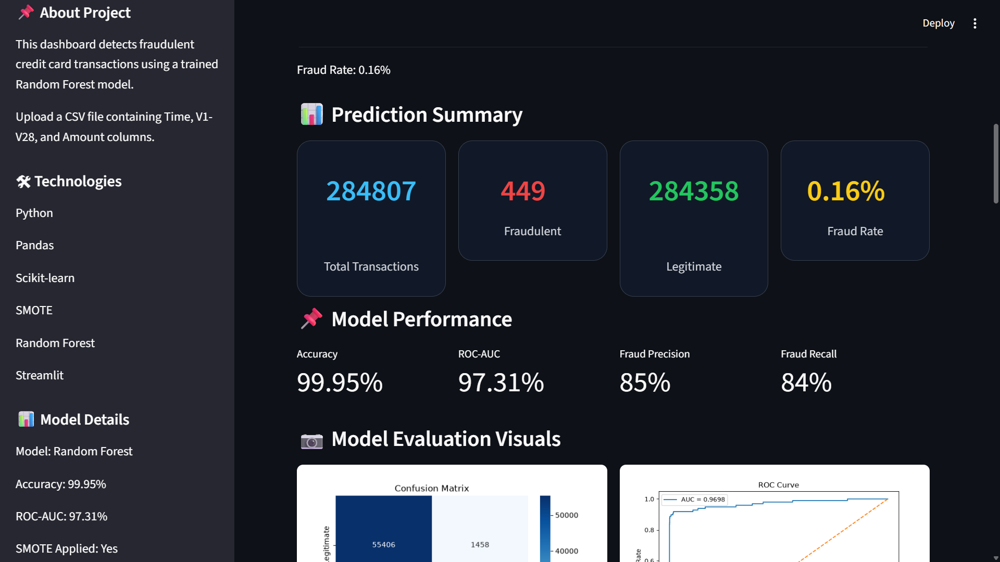

# 💳 AI-Powered Payment Fraud Detection
## 🚀 Live Demo

https://payment-fraud-detection-mpfdnpbsev4qrhyf74tg2x.streamlit.app
## Dashboard Preview

<p align="center">
  
</p>
A machine learning-based fraud detection dashboard developed using Random Forest, SMOTE, Streamlit, and Python.

## Features

- Upload transaction CSV files
- Detect fraudulent transactions
- Fraud probability calculation
- Prediction summary dashboard
- Interactive visualizations
- Fraud distribution charts
- Top suspicious transactions
- Download prediction results

## Technologies Used

- Python
- Pandas
- Scikit-learn
- Random Forest
- SMOTE
- Streamlit
- Matplotlib

## Model Performance

- Accuracy: 99.95%
- ROC-AUC: 97.31%
- SMOTE Applied: Yes

## Run Locally

```bash
pip install -r requirements.txt
streamlit run app.py
```

## Developer

Asaduddin R.S.